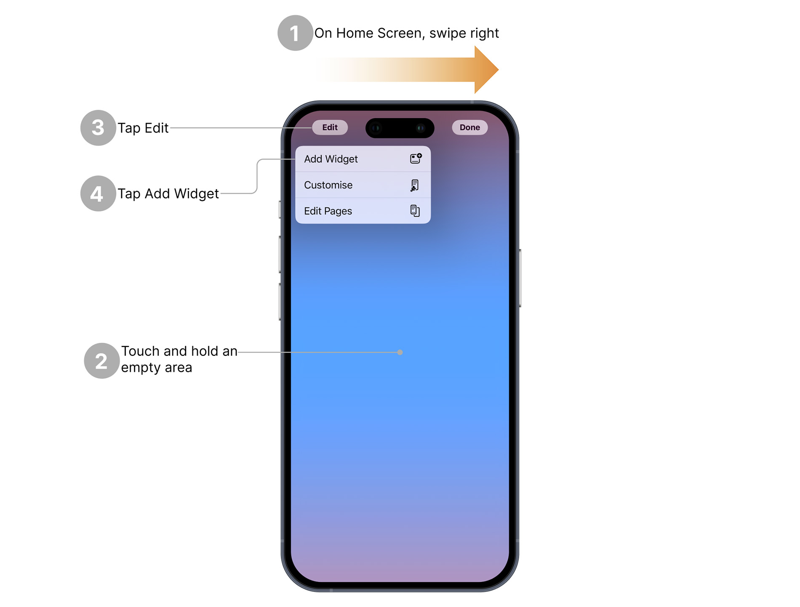
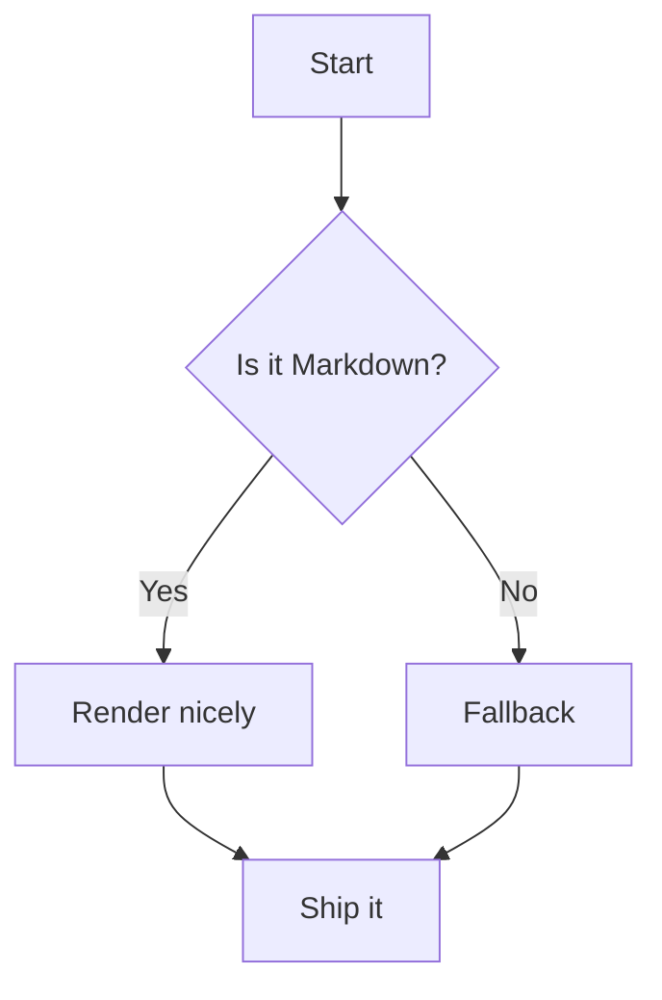
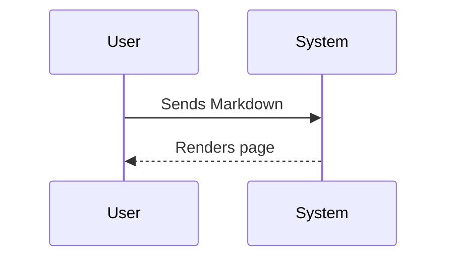

# Welcome

This is Welcome.md file

This is image from assets


Testing markdown syntax and how it's rendered in Archbee.

**Quick jump:**

- [Headings](./#headings)
- [Text styles](./#text-styles)
- [Links](./#links)
- [Images](./#images)
- [Videos & audio](./#videos--audio)
- [Lists](./#lists)
- [Task lists](./#task-lists)
- [Tables](./#tables)
- [Code & syntax highlighting](./#code--syntax-highlighting)
- [Quotes & callouts](./#quotes--callouts)
- [Details / accordion](./#details--accordion)
- [Definition lists](./#definition-lists)
- [Math](./#math)
- [Mermaid diagrams](./#mermaid-diagrams)
- [Footnotes](./#footnotes)
- [Rules, escapes, emoji](./#rules-escapes-emoji)
- [Inline HTML test](./#inline-html-test)

***

## Headings

# H1 Heading

## H2 Heading

### H3 Heading

### H4 Heading

### H5 Heading

### H6 Heading

Paragraph under headings. Line breaks work with two spaces at end.
This is a second line.

***

## Text styles

Regular text, **bold**, *italic*, ***bold italic***, ~~strikethrough~~, underline (HTML), `inline code`, highlight (HTML), H~~2~~O (via HTML: H2O), 10^6 (via HTML: 106).

:::Iframe{code="<sup>"}

:::

:::Iframe{code="<sub>"}

:::

:::Iframe{code="<mark>"}

:::

:::Iframe{code="<u>"}

:::

Block of text with soft-wrap and hard-wrap differences.
This line intentionally ends with two spaces to force a break.

***

## Links

- Inline link: [Archbee](https://archbee.com)
- Reference link:&#x20;
- Autolink: [https://example.com](https://example.com)
- Email: [mailto\:hello@example.com](mailto\:hello@example.com)
- Anchor to a section: [Jump to Tables](./#tables)
- Image-as-a-link: [https://shields.io](https://shields.io)

***

## Images

Markdown images with alt + title:


Relative image path (may 404 in some viewers):



Reference-style image:


HTML image with width control:


***

## Videos & audio

**YouTube via linked thumbnail (common Markdown pattern):**

::embed[[](https://www.youtube.com/watch?v=dQw4w9WgXcQ)[https://www.youtube.com/watch?v=dQw4w9WgXcQ](https://www.youtube.com/watch?v=dQw4w9WgXcQ)]{url="https://www.youtube.com/watch?v=dQw4w9WgXcQ"}

### Testing local videos

***

## Lists

Unordered list:

- Item A
  - Nested A.1
    - Nested A.1.a
- Item B

Ordered list (start at 3):
3\. Three
4\. Four
5\. Five

Mixed list:

- First

1. Second (numbered inside bullets)

- Third

***

## Task lists

- [x] Parse Markdown
- [x] Render tables
- [ ] Support admonitions

***

## Tables

Basic table:

| Feature   | Supported | Notes                     |
| --------- | --------- | ------------------------- |
| Bold      | ✅         | `**text**`                |
| Italic    | ✅         | `*text*`                  |
| Underline | ⚠️        | HTML only                 |
| Footnotes | ✅         | See [below](./#footnotes) |

Table with images & links:

| Avatar                          | User      | Link                                 |
| ------------------------------- | --------- | ------------------------------------ |
|  | **Alice** | [Profile](https://example.com/alice) |
|  | **Bob**   | [Website](https://example.com)       |

***

## Code & syntax highlighting

Inline: `const hi = "world";`

Fenced (JavaScript):

```javascript
export function greet(name) {
  return `Hello, ${name}!`;
}
console.log(greet("Archbee"));
```

Fenced (Python):

```python
def fib(n):
    a, b = 0, 1
    seq = []
    while len(seq) < n:
        a, b = b, a + b
        seq.append(a)
    return seq

print(fib(10))
```

Fenced (Bash):

```bash
#!/usr/bin/env bash
set -euo pipefail
curl -I https://archbee.com
```

Diff block:

```diff
+ Added line
- Removed line
! Changed line (not standard, but some themes show this)
```

JSON block:

```json
{
  "name": "archbee-md-test",
  "private": true,
  "scripts": { "start": "node index.js" }
}
```

YAML block:

```yaml
name: archbee-md-test
on:
  push:
    branches: [ main ]
```

***

## Quotes & callouts

Regular blockquote:

>

GitHub/Docs-style admonitions (blockquote + label):

>

>

>

>

>

:::hint{type="success"}
This is a callout from Archbee.
:::


Nested blockquote:

>

>

***

## Details / accordion

Click to expand details

Hidden content with **bold**, code `x = 42`, and a small list:

- Point 1
- Point 2

Another paragraph.


***

## Definition lists

Term 1
: Definition for term 1

Term 2
: Multi-line definitions are fine.
Second line here.

***

## Math

Inline math: $E=mc^2$ and $\alpha + \beta = \gamma$.

Display math:

$$
\int\_\{-\infty}^\{\infty} e^\{-x^2} , dx = \sqrt\{\pi}
$$

***

## Mermaid diagrams

Flowchart:



Sequence diagram:



***

## Footnotes

Here is a statement that needs a footnote. And another one.

***

## Rules, escapes, emoji

Horizontal rules:

***

***

***

Escaped characters: \*literal asterisks\*, \_underscores\_, \`backticks\`, #hash.

Emoji shortcodes: 🚀 🎉 ⚡ ⚠️

***

## Inline HTML test

Cmd + K to open link dialog.

:::Iframe{code="<kbd>"}

:::

:::Iframe{code="<kbd>"}

:::

HTML Button

:::Iframe{code="<button type=&#x22;button&#x22;>"}

:::

:::Iframe{code="<div style=&#x22;padding:8px;border:1px dashed;&#x22;>Inline HTML container with <strong>bold</strong> and <em>italic</em>.</div>"}

:::

***

*The end. Back to&#x20;*[*top*]()*.*
