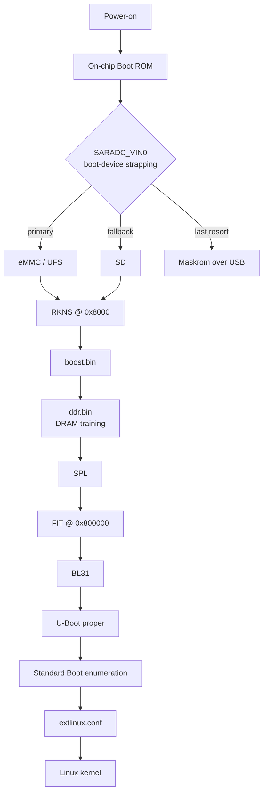

This page describes the boot sequence and on-flash image layout for the Rockchip RK3576 SoC as used in Flipper One. For an inventory of the individual bootloader components themselves (Boost, DDR trainer, SPL, BL31, BL32) see the [RK3576 mainlining page](https://docs.flipper.net/one/cpu-software/rk3576-mainlining); this page focuses on the order in which they run and where they live on flash.

## Boot sequence

There are five distinct stages between power-on and the kernel taking over.

### 1. On-chip Boot ROM

The Boot ROM begins executing as soon as power is applied to the SoC. It enumerates the available boot devices in an order determined by the strapping of the `SARADC_VIN0` hardware pin — typically eMMC → SD, or UFS → SD on UFS-equipped boards. If none of the regular devices contain a valid boot image, the ROM falls back to **Maskrom mode**, in which an attached host computer can upload arbitrary code over USB for execution.

### 2. RKNS image (TPL + SPL)

The Boot ROM searches each enumerated storage device for a valid **RKNS** image signature at byte offset `0x8000`. On 512-byte-sector devices (SD/MMC) this maps to sector 64; on 4096-byte-sector devices (UFS) this maps to sector 8.

The first storage device with a valid RKNS image gets booted. The RKNS container holds a sequence of binaries that execute in order. For RK3576 a typical RKNS payload is:

* `boost.bin` — patches portions of the ROM code held in SRAM and configures UFS power-mode parameters.
* `ddr.bin` — initialises the DDR memory controller and runs RAM parameter training.
* **SPL** — runs from RAM after DDR is up; its job is to locate the storage device containing the main bootloader's FIT image.

### 3. FIT image (main bootloader)

The SPL loads a **FIT** image from a fixed flash offset that is baked into the SPL at build time. The common default is byte offset `0x800000`. The FIT image bundles:

* A device-tree blob (DTB) describing the on-board peripherals.
* U-Boot proper.
* ARM Trusted Firmware (BL31).
* Optionally, TEE-OS (BL32).

The execution order inside the FIT is driven by the FIT's configuration node. In a normal boot, BL31 runs first and orchestrates the remaining components.

### 4. U-Boot

By the time U-Boot proper is running, the system is versatile enough that no single "boot flow" applies — U-Boot can be configured to load almost anything from almost anywhere.

The relevant practical distinction for RK3576 is between the two U-Boot lineages used in the wider Rockchip ecosystem:

* **Rockchip vendor U-Boot** is based on a 2017 codebase and typically boots via fixed, hard-coded commands.
* **Mainline U-Boot**, which Flipper One uses, switched to **Standard Boot**: it enumerates each available storage device, looks for bootable partitions on each, and tries several boot methods per partition (`extlinux.conf`, EFI bootable binaries, PXElinux scripts, etc.).

### 5. Linux

Current Flipper One test images boot Linux via `extlinux.conf`. This may change as the build system stabilises.

## Flash layout

Only two positions on flash are positionally significant — everything else is located via offsets stored inside the images themselves, or via partition tables consulted by U-Boot.

<table isTableHeaderOn="true" columnWidths="120,120,160,320">
  <tr><td>
<strong>Byte offset</strong>
</td><td>
<strong>Format</strong>
</td><td>
<strong>Loaded by</strong>
</td><td>
<strong>Contents</strong>
</td></tr>
  <tr><td>
<code>0x8000</code>
</td><td>
RKNS
</td><td>
On-chip Boot ROM
</td><td>
TPL + SPL (boost.bin, ddr.bin, SPL)
</td></tr>
  <tr><td>
<code>0x800000</code>
</td><td>
FIT
</td><td>
SPL
</td><td>
U-Boot, BL31, optional BL32, DTB
</td></tr>
</table>

The `0x8000` offset is fixed by the Boot ROM and cannot be changed. The `0x800000` figure is the common default; the actual value is configured at SPL build time and lives inside the SPL binary.

## Combined bootloader image (`u-boot-rockchip.bin`)

Modern mainline U-Boot produces a single combined bootloader image, `u-boot-rockchip.bin`, in which the RKNS portion and the FIT portion are already placed at the correct offsets with the necessary padding between them. Flashing this single image to the start of the boot device puts both pieces where the Boot ROM and the SPL expect them. For most users — and for the current Flipper One build — the internal structure of the two images is therefore transparent.

## A note on legacy naming

The terms **`miniloader`** and **`idbloader`** show up in older Rockchip Wiki pages and in pre-RK35-series tooling. They refer to bootloader sub-images that are no longer used in the current stack and should not appear in any discussion of the RK3576 boot flow. If you find them in third-party documentation, treat that documentation as outdated.

## Diagram

## References

* RK3576 boot flow description originally provided by @alchark in [flipperdevices/flipperone-docs#52](https://github.com/flipperdevices/flipperone-docs/issues/52#issuecomment-4508413110).
* Component-level overview of the bootloader chain — [RK3576 mainline support](https://docs.flipper.net/one/cpu-software/rk3576-mainlining).
* [Collabora's RK3576 mainline status](https://gitlab.collabora.com/hardware-enablement/rockchip-3588/notes-for-rockchip-3576/-/blob/main/mainline-status.md) — tracks which parts of the boot chain are mainlined.
